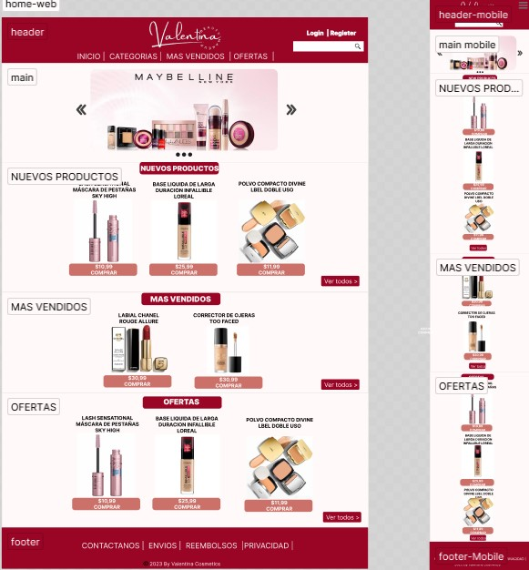
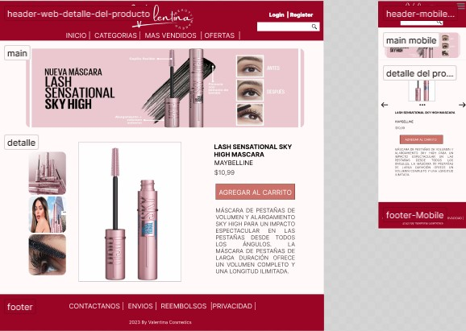
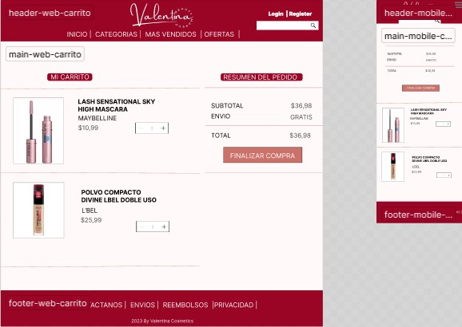
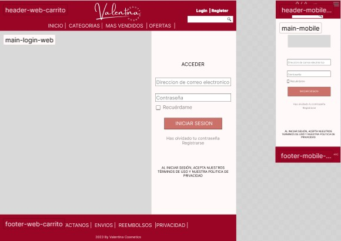
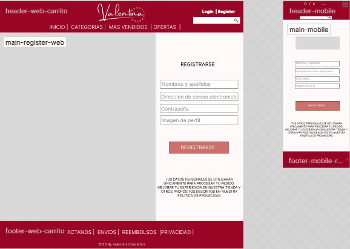

# ***Valentina Cosmetics***
## Sitio web de compra de maquillaje
### Audidiencia objetivo:
La audiencia objetivo de este sitio web es mujeres de cualquier edad, con interés en productos de maquillaje y el área de la belleza.
### Integrantes del grupo: 
#### ___Oriana Guerrero:___
Soy una chica de 21 Años, divertida, disciplinada, algo que me gusta de mi es que cumplo  con cada objetivo que me propongo, en esta oportunidad mi objetivo es completar este curso de programación web full stack, y ser una de las mejores programadoras.
#### ___Felipe Mendez:___
-Estudiante es proceso de profesionalización, 19 años, apasionado por la programación web full stack, especialmente en el backend.
### Inspiracion en referentes del mercado:

Los sitios con los que nos hemos referenciado para realizar este proyecto son:

- https://www.rubyrose.com.co/
-	https://www.salomemakeupoficial.com/
-	https://www.nyxcosmetics.es/
-	https://purpuremakeup.com/
-	https://krizrealestudio.com/
### Enlace del diseño:

El diseño preliminar se ha realizado con *Figma* y se puede encontrar en la siguiente URL

https://www.figma.com/file/MVaCgycdDdQFZXCV3udwyB/Valentina_Cosmetics?node-id=0%3A1&t=85XegRpQyrIhGyPQ-0

## Diseño 
#### Homepage: 

#### Article: 

#### Carrito:
 

 #### Login:
 

 #### Register:
 
 ### Para clonar el repositorio usar:

`git clone https://github.com/Orianaguerrero/Valentina_Cosmetics.git `

### Para actualizar el repositorio local usar:

`git pull  https://github.com/Orianaguerrero/Valentina_Cosmetics.git `

### Para actualizar el repositorio remoto usar:

`git push  https://github.com/Orianaguerrero/Valentina_Cosmetics.gitt `

### Enlace Trello:

[Trello - GamesHub](https://trello.com/b/28xDNyPH/valentina)
